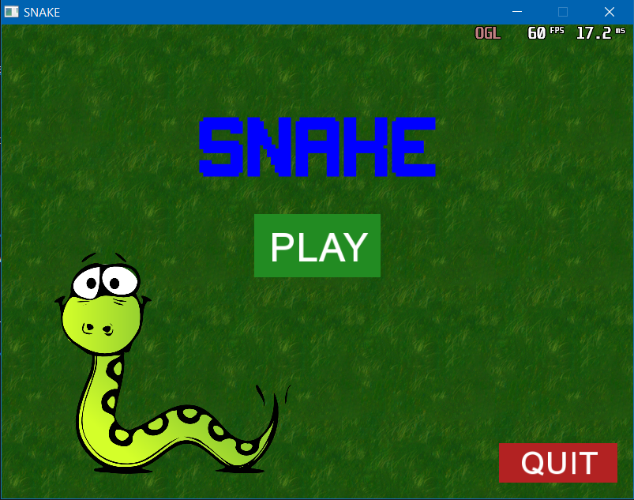
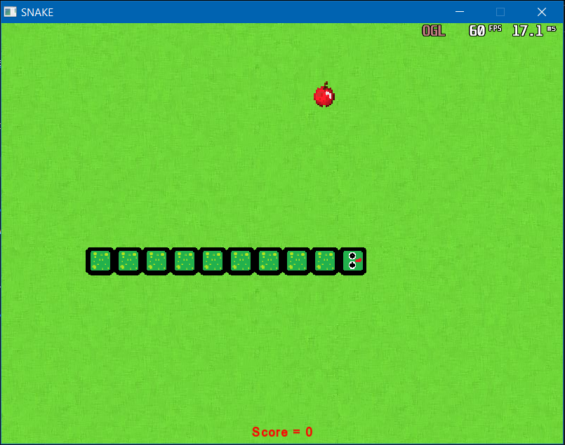

# Snake game
 
## Table of contents
* [General info](#general-info)
* [Technologies](#technologies)
* [Illustrations](#llustrations)
* [Setup](#setup)

## General info
A simple Snake game written in C++ using the SFML library. The game was created in order to learn how to use the billboard mentioned just now.

## Technologies
Project is created with:
* C++ 17
* SFML 2.5.1

## Illustrations
* Simple menu

* And the game itself

## Setup
To start the game, follow the instructions on the SFML page: 
[Tutorial](https://www.sfml-dev.org/tutorials/2.5/#getting-started)
or use Cmake.
